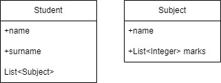

# Lekce 7
Vytvořte nový projekt JavaFX aplikace a pomocí objektů vypracujte následující zadání.

- Vytvořte program pro výpis průměrných známek žáků.
- Každý žák má jméno, pole známek z předmětu a vaším ukolem je vypsat jméno žáka a vedle něho jeho průměrnou známku.
